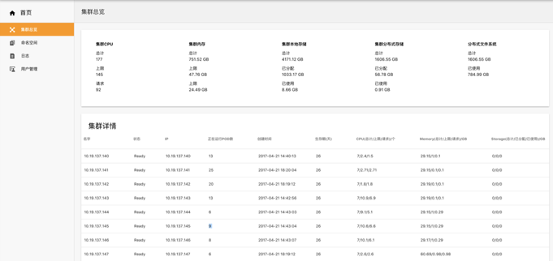
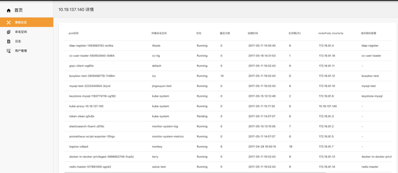

## 集群总览

集群总览是查看**整个集群系统的资源总量及使用情况**，以及**各个物理节点的详细信息**，其中包括:

- **整个集群**的CPU（总量、上限、请求），内存（总量、上限、请求），集群本地存储（总量、已分配、已使用）、集群分布式存储（总量、已分配、已使用）、分布式文件系统（总量、已使用）
- **整个集群**的CPU（总量、上限、请求），内存（总量、上限、请求），集群本地存储（总量、已分配、已使用）、集群分布式存储（总量、已分配、已使用）、分布式文件系统（总量、已使用）
  - 运行在该节点的所有的pod的详细信息：pod名称、所属命名空间、状态、重启次数、创建时间、生存期、ClusterIP、相关联部署

##### 操作步骤

1. 点击左边导航栏 - 集群总览

2. 点击其中某个物理节点

