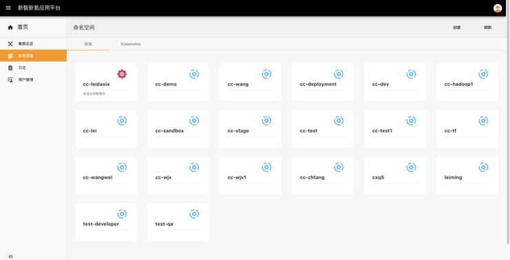
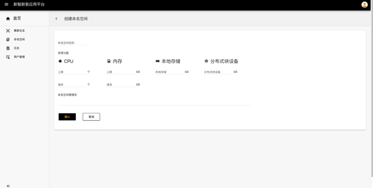
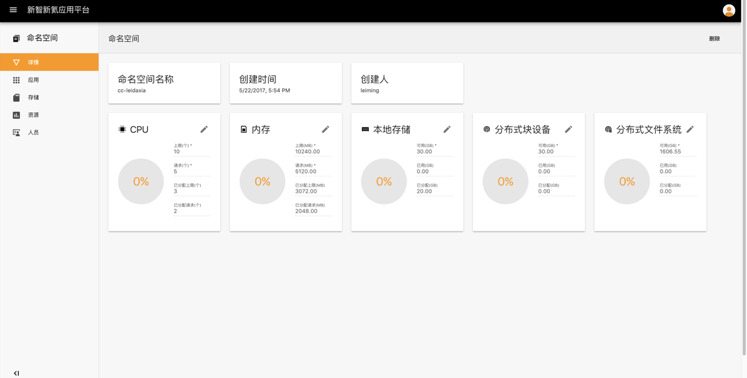

## 命名空间

命名空间主要是对多租户进行**资源隔离**，形成逻辑上分组的不同项目、小组或用户组，便于不同的分组在共享使用整个集群的资源的同时还能被分别管理。不同角色的用户具有不同的权限，可以进行的操作有所不同：

- 对于**系统管理员**，可以进行的操作有：
  - 可以查看到整个集群所有的命名空间
  - 可以删除命名空间
  - 可以添加用户为命名空间管理员
  - 可以查看命名空间详情、命名空间资源、命名空间管理员列表
  - 可以修改命名空间的资源配额
  - 不可以查看命名空间的应用列表、存储列表，添加用户为命名空间开发者
- 对于**命名空间管理员**，可以进行的操作有：
  - 可以查看命名空间详情、命名空间资源、命名空间管理员及开发者列表
  - 可以修改命名空间资源配额
  - 可以更改用户的角色
  - 可以查看命名空间的应用列表、存储列表，添加和删除命名空间管理员或开发者
  - 可以创建应用、存储，删除应用、存储
  - 不可以删除命名空间
- 对于**命名空间开发者**，可以进行的操作有：
  - 可以查看命名空间详情、命名空间资源、命名空间管理员及开发者列表
  - 可以修改命名空间配额
  - 可以查看命名空间的应用列表、存储列表
  - 可以创建应用、存储，删除应用、存储
  - 不可以添加和删除命名空间管理员或开发者
  - 不可以更改用户角色
  - 不可以删除命名空间

##### 操作步骤

1. 点击左侧导航栏 - 命名空间，标准是通过应用平台创建的命名空间，Kubernetes是通过后台创建的命名空间。假如用户是命名空间管理员，那么在命名空间下面会标示命名空间管理员。
2. 点击创建，需要配置命名空间的**名称、CPU（上限、请求）、内存（上限、请求）、本地存储、分布式块设备**
3. 点击进入具有命名空间管理员权限的命名空间