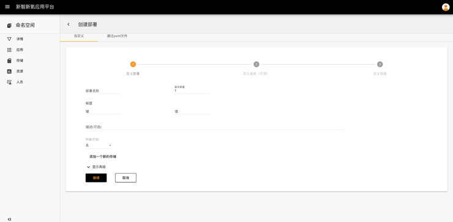
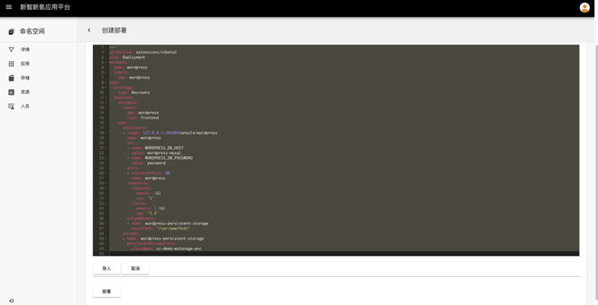

## 应用

应用是介于命名空间与部署之间的概念，是由一系列**部署文件、服务文件**编排而成的，不同的应用之间是**相互独立的**，例如WordPress、Hadoop在新智新氦应用平台上属于独立的应用。

##### 创建应用流程

##### 操作步骤

1. 点击二级导航栏 -应用

2. **创建应用，选择创建应用的方式：**

   **自定义应用，编辑应用名称**

   - 创建成功后，页面会跳转到应用列表页面

   - 点击WordPress应用，进入创建应用部署、服务的详情页

   - 这里创建应用部署采用两种方式，一种是**分步骤按照表单的形式**，另一种是**直接上传部署的yaml文件**

     - **通过表单创建部署**

       **定义部署：用户需要配置部署名称、副本数量、标签、选择已有存储或者创建新的存储、在高级选项中，需要设置部署策略：Recreate或者Rolling Update等**

       **定义服务**（可选），用户可以设置外部访问内部服务的方式

       **定义容器**

       - 其中**高级设置**可以设置容器端口、容器资源配额、运行命令和参数、环境变量等

     - 通过**直接上传yaml文件创建部署**，通过在线编辑或者上传yaml文件，点击部署进行创建

     - 部署成功后，页面会自动调转至应用详情页，应用详情页包括：**部署列表、服务列表以及拓扑图**，其中**拓扑图**是展示pod、存储、服务、部署之间关系的示意图

   ​

   **通过预置应用一键部署应用**，预置应用包括了网站开发、大数据处理、流式数据处理、机器学习等领域的常见的应用，现已支持WordPress、Hadoop、Spark、Storm应用部署

   - 点击创建Hadoop，所有参数均有默认值，点击创建应用，即可一键部署Hadoop应用

3. 点击某个部署，展示的是部署详情以及部署的pod信息

4. 点击某个服务，展示的是服务详情以及部署的pod信息

5. 应用拓扑图

   - 在拓扑图中，点击某个pod，会弹出pod详细信息的窗口，同样点击部署、存储、服务，弹出对应的详细信息的窗口
   - 在拓扑图中，点击➕➖后，会自动对pod的副本数进行**扩充**或者**减少**，默认至少保留一个pod副本