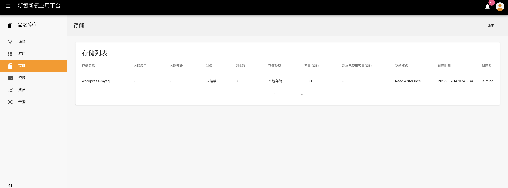
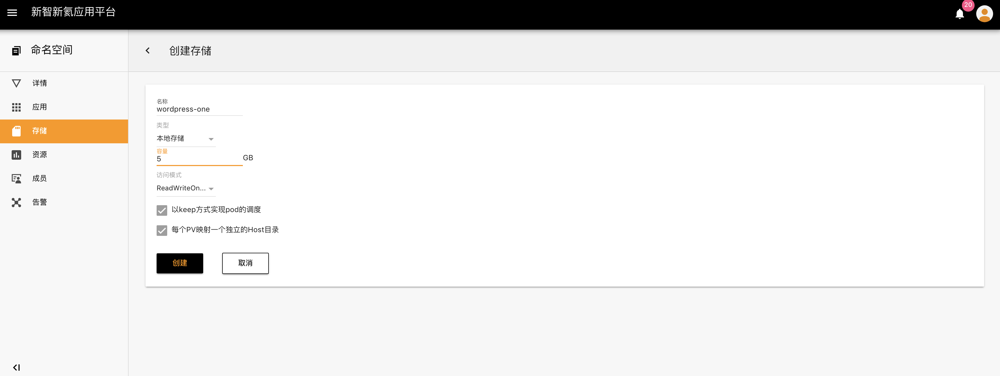
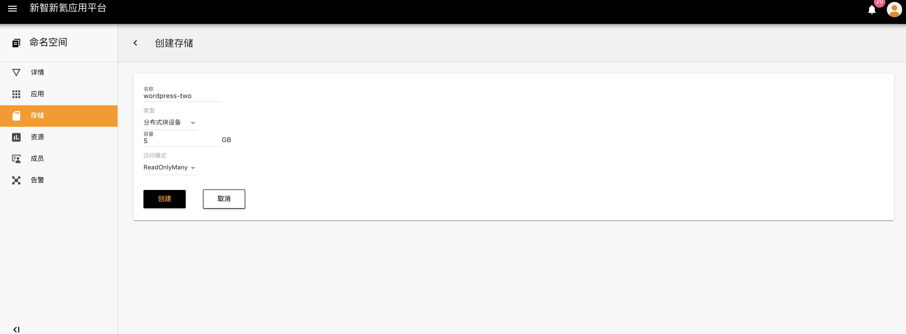
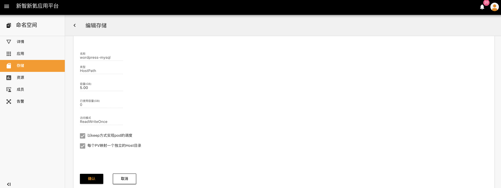
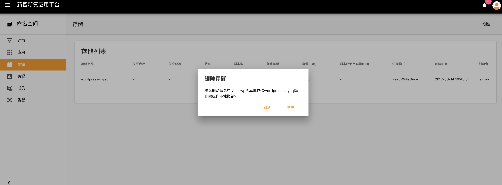

## 存储

应用平台存储包括**本地存储、分布式块设备、分布式文件系统**，目前只有本地存储、分布式块设备可以进行创建，存储创建完成后，可以关联应用，也可以删除存储

##### 操作步骤

1. 点击命名空间--存储，进入存储列表页面

2. 创建存储，需要首先设置存储名称、存储类型（本地存储、分布式块设备、分布式文件系统）、存储容量，以及存储访问模式

   - 创建本地存储

     - 需要设置容量大小
     - 选择访问模式：目前只有一种访问模式：**ReadWriteOnce**
     - 选择是否以keep方式实现pod的调度：当pod失败后，新产生的pod仍然挂载之前pod的文件目录，保证数据不丢失
     - 选择是否让每个PV映射一个独立的Host目录：当部署关联存储时，所有的pod副本均需要创建一个独立的Host目录，所有pod副本的存储能力=本地存储设置容量大小*副本数

     创建一个本地存储wordpress-one 

   - 分布式块设备包含**ReadWriteOnce、ReadWriteMany**两种模式

   - 修改存储配额和配置参数

   - 删除存储，存储数据全部删除

   ​

   ​