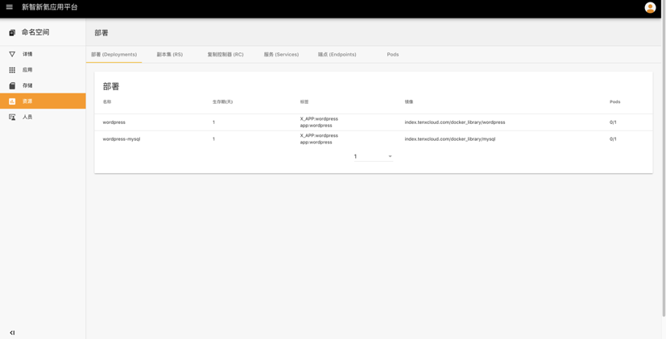
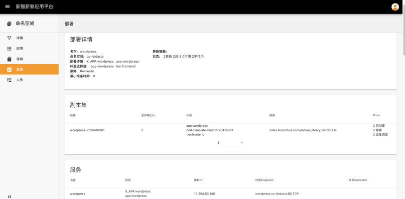
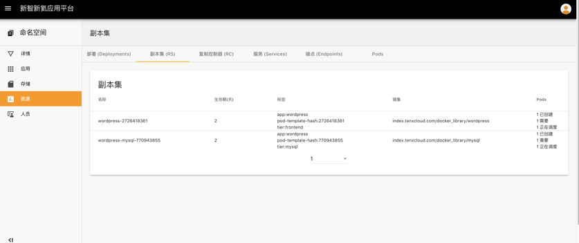
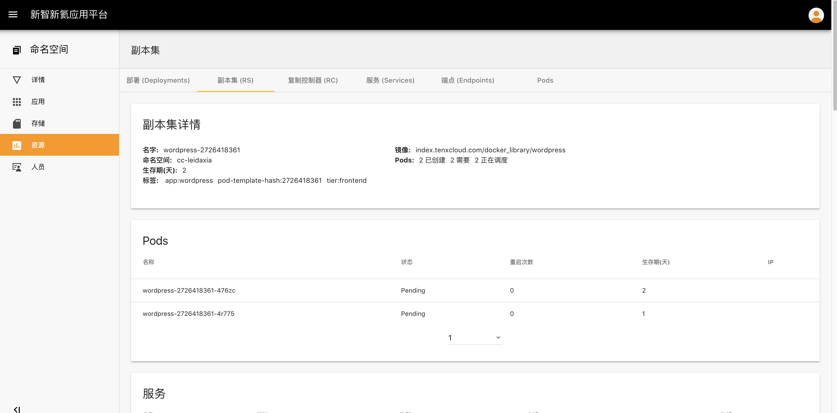
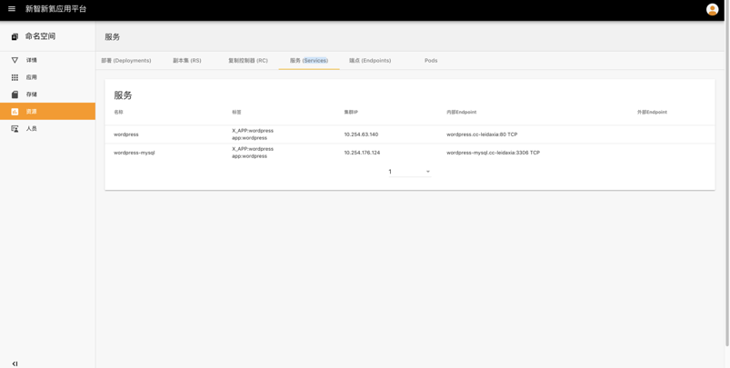
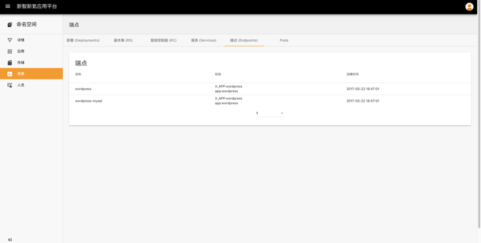
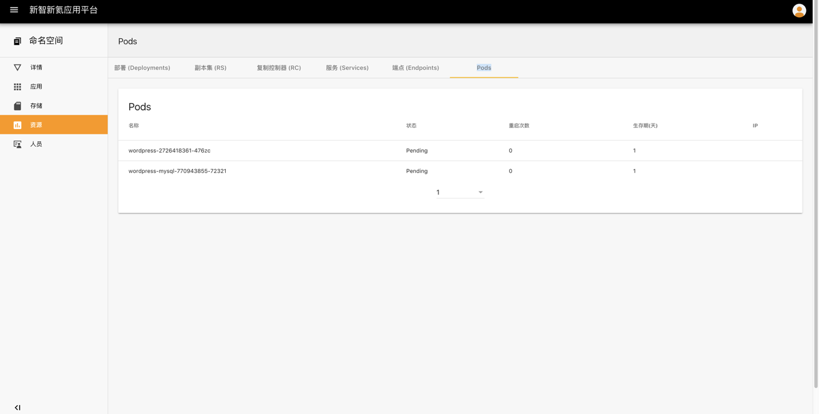

## 资源

资源是存在于整个命名空间的属于不同应用的资源集合，包括**部署**、副本集、复制控制器、服务、端点、pod信息的资源列表以及各个资源的详细信息，命名空间管理员或者开发者可以对不同的资源进行删除。

##### 操作步骤

1. 点击左侧导航栏 - 资源

   - 部署

     点击某个部署，展开

   - 副本集

     点击某个副本，展开

   - 复制控制器

   - 服务

   - 端点

   - pods

     ​