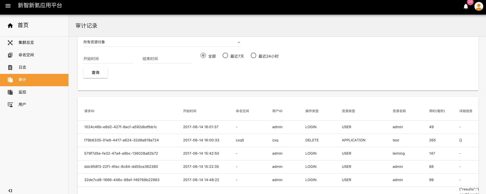

## 审计

审计记录是会提供多种过滤条件对操作记录查询，可以实现安全分析、资源变更追踪以及合规性审计。

审计记录主要分为**操作日志、请求日志**两种：

- 操作日志记录的是用户对所有集群资源对象进行的操作，用户可以通过选择资源对象和时间的过滤条件查询操作日志：

  - 所有资源对象包括：
    - 命名空间
    - 用户
    - 应用
    - 分布式存储
    - 本地存储
    - 角色分配
    - 服务
    - 部署
    - CPU
    - 内存

- 请求日志记录的是用户对所有集群资源对象进行的操作时，产生的一系列对后台服务的请求结果，用户可以选择所有服务类型和时间的过滤条件查询请求日志：

  - 所有服务类型包括：

    - api-server
    - 后端
    - gateway

    ​

##### 操作步骤

1. 点击左边导航栏一级目录 - 审计，即可看到审计记录的页面，审计记录页面默认是操作日志的查询界面：对所有资源对象的操作按时间从后往前进行排序

   选择角色分配、最近24小时两个查询条件，点击查询 

2. 切换至请求日志，选择后端服务类型和24小时两个查询条件，点击查询

   ​

   ​

